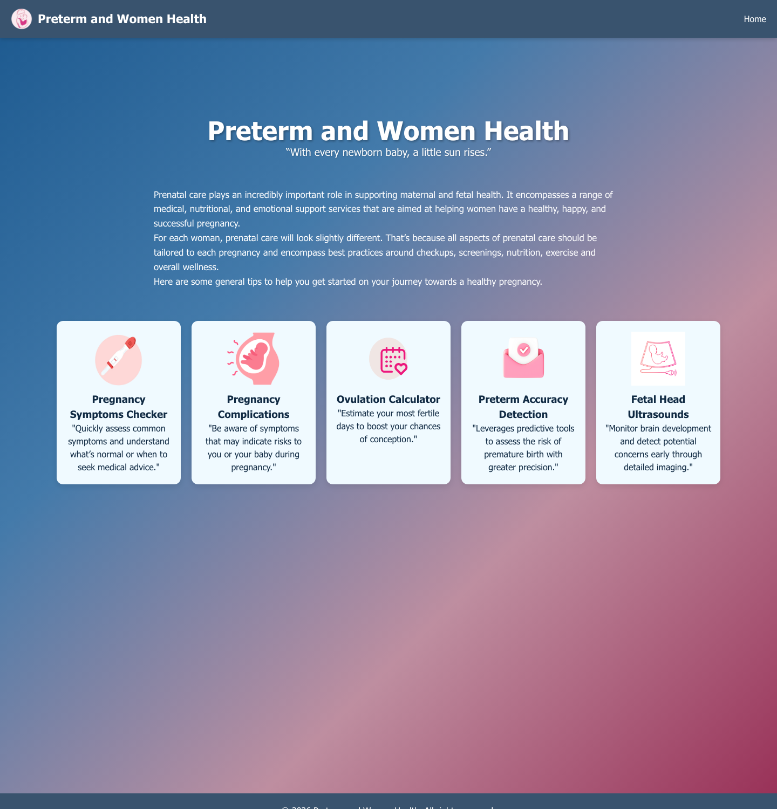
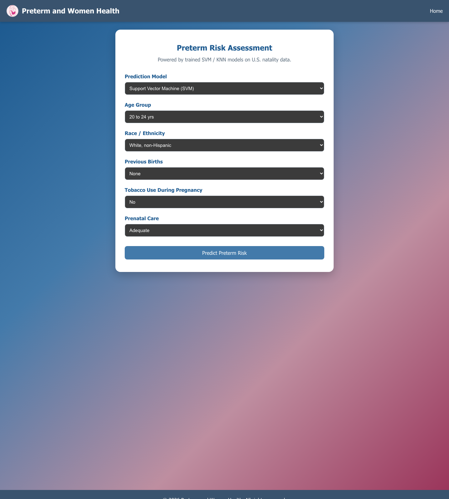
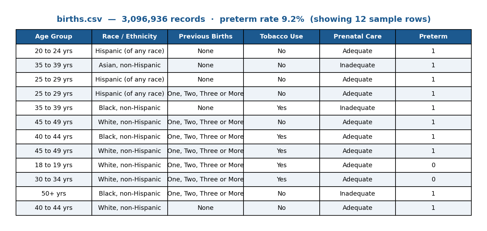
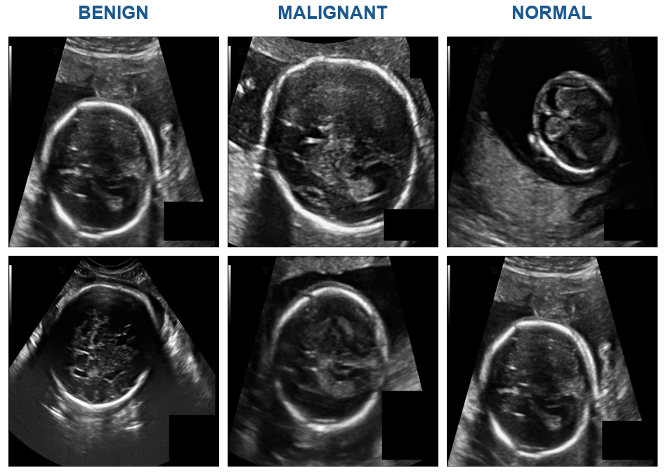

# Preterm and Women Health

> © 2026 Hazem. **All Rights Reserved.** This code is shared publicly for
> portfolio/evaluation viewing only. You may **not** copy, reuse, or modify it
> without written permission. See [LICENSE](LICENSE).

A full-stack **women's-health web application** that combines a modern React
interface with a Python machine-learning backend to (1) estimate **preterm-birth
risk** from maternal factors and (2) classify **ultrasound images**.

**Datasets:** trained on **~3.1M U.S. natality records** (preterm-birth risk) and a
**3-class ultrasound image dataset** (benign / malignant / normal). See
[Dataset Samples](#dataset-samples) below.


---

## Demo

A full walkthrough of every feature — including **live SVM preterm-risk prediction**
and **live ultrasound image classification** (real results, not mock-ups):


▶ **[Watch the full-resolution MP4](docs/video/demo.mp4)**

---

## Screenshots

| Home | Preterm Risk Assessment |
|------|-------------------------|
|  |  |

---

## Features

| Feature | Description | Tech |
|---------|-------------|------|
| **Preterm Risk Assessment** | Enter maternal factors (age, ethnicity, prior births, tobacco use, prenatal care) and get a real risk prediction from a trained model. | SVM / KNN (scikit-learn) |
| **Fetal / Breast Ultrasound Classification** | Upload an ultrasound image and receive a class (benign / malignant / normal) with confidence and per-class probabilities. | EfficientNet (TF/Keras), ResNet (PyTorch) |
| **Pregnancy Symptoms Checker** | Guidance on common pregnancy symptoms. | React |
| **Pregnancy Complications** | Awareness of risk symptoms. | React |
| **Ovulation Calculator** | Estimate the fertile window. | React |

---

## Tech Stack

- **Frontend:** React 19 (Create React App), React Router, Axios
- **Backend:** Flask + Flask-CORS, REST JSON API
- **Classic ML:** scikit-learn (SVM, KNN) with label encoders + scalers, served via joblib
- **Deep Learning:** TensorFlow/Keras (EfficientNetB0) and PyTorch (ResNet) for image classification

---

## Documentation & Presentation

- 📄 **[Full project documentation (Word)](documentation/Graduation-Project-Documentation.docx)** — Cairo University graduation project report (introduction, related work, system analysis & design, implementation, testing).
- 📊 **[Project presentation (PowerPoint)](documentation/Preterm-and-Women-Health-Presentation.pptx)**

---

## Dataset Samples

> Full datasets are **not** included in this repository (size and privacy). These
> are small, representative samples to illustrate what the models were trained on.

**Preterm-risk data — `births.csv`** (~3.1M U.S. natality records, 9.2% preterm rate):



A 60-row sample is included at
[`docs/data-samples/births_sample.csv`](docs/data-samples/births_sample.csv).

**Ultrasound image data** (3 classes — benign / malignant / normal):



Six sample images are in [`docs/data-samples/ultrasound/`](docs/data-samples/ultrasound).

---

## Machine-Learning Engineering Highlights

This project was as much about **honest ML evaluation** as about building models:

- **Caught a data-leakage bug.** An initial ultrasound model reported ~75% accuracy —
  but the augmented training set turned out to contain augmented copies of *every*
  test image. After rebuilding on clean, non-overlapping train/validation/test
  splits, the honest accuracy is ~49% balanced (vs. 33% random) — a realistic
  number instead of a misleading one.
- **Fixed an EfficientNet preprocessing bug** (double-normalization) that was pinning
  training accuracy at chance level.
- **Compared architectures fairly** — EfficientNet, ResNet, and an ensemble — all
  evaluated by *balanced* accuracy to account for heavy class imbalance.
- **Corrected a feature-ordering bug** in the tabular pipeline that silently broke the
  scikit-learn scaler, and wired the real model into the UI (replacing mocked output).

> The ultrasound classifier is intentionally reported at its true accuracy; the
> limiting factor is dataset size (~240 images each for the benign/normal classes).

---

## Running Locally

```bash
# 1. Backend (Flask ML API) — http://localhost:5000
python3 -m venv .venv
./.venv/bin/pip install -r requirements.txt
./.venv/bin/python app.py

# 2. Frontend (React) — http://localhost:3000
npm install
npm start
```

Or start both at once:

```bash
./start.sh
```

> **Note:** trained model files and datasets are **not** included in this
> repository (they are large binaries / private data). The training scripts
> (`train_model.py`, `improved_train.py`, `pytorch_train.py`) regenerate the
> models from the source dataset.

### API

- `GET /health` — reports which models are loaded.
- `POST /predict` — tabular preterm-risk prediction (SVM/KNN).
- `POST /predict_ultrasound` — image classification (multipart upload).

---

## Project Structure

```
src/                 React frontend (pages, components, routing)
app.py               Flask API (SVM/KNN + ultrasound endpoints)
train_model.py       EfficientNet ultrasound training
improved_train.py    Clean-split EfficientNet training (leak-free)
pytorch_train.py     ResNet (PyTorch) training
eval_*.py            Model evaluation / comparison scripts
SVM.py, KNN.py       Classic ML training
requirements.txt     Python dependencies
```

---

## License

© 2026 Hazem. All Rights Reserved. This repository may be **viewed for
evaluation purposes only**. Copying, reuse, modification, or redistribution is
prohibited without written permission — see [LICENSE](LICENSE).
